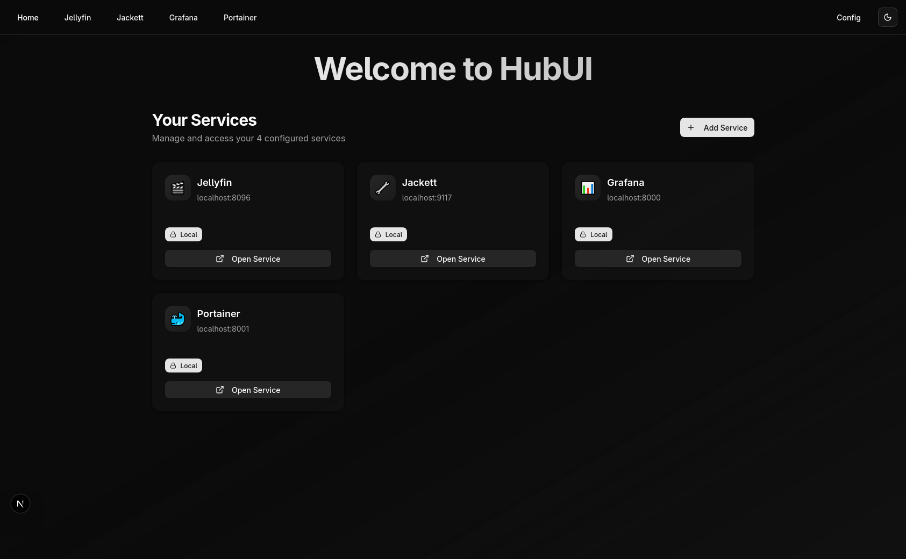

<div align="center"><a name="readme-top"></a>


# HubUI

An open-source, service aggregator dashboard.<br/>
Centralize all your local web services in one interface with iframes embedding.<br/>

**English** · [Official Repository](https://github.com/enrellsa/hubui) · [Docker Hub](https://hub.docker.com/r/enrellsa/hubui) · [Changelog](https://github.com/enrellsa/hubui/releases) · [Documentation](https://github.com/enrellsa/hubui#-getting-started) · [Feedback](https://github.com/enrellsa/hubui/issues)

<!-- SHIELD GROUP -->

[![][github-release-shield]][github-release-link]
[![][github-stars-shield]][github-stars-link]
[![][github-forks-shield]][github-forks-link]
[![][github-issues-shield]][github-issues-link]
[![][github-license-shield]][github-license-link]<br/>
[![][typescript-shield]][typescript-link]
[![][nextjs-shield]][nextjs-link]
[![][tailwind-shield]][tailwind-link]

**Share HubUI Repository**

[![][share-x-shield]][share-x-link]
[![][share-telegram-shield]][share-telegram-link]
[![][share-whatsapp-shield]][share-whatsapp-link]
[![][share-reddit-shield]][share-reddit-link]
[![][share-linkedin-shield]][share-linkedin-link]

<sup>Your personal service hub. Built for simplicity and elegance.</sup>



</div>

<details>
<summary><kbd>Table of contents</kbd></summary>

#### TOC

- [👋🏻 Getting Started](#-getting-started)
- [✨ Features](#-features)
  - [`1` Service Management](#1-service-management)
  - [`2` Secure Iframe Integration](#2-secure-iframe-integration)
  - [`3` Local Storage](#3-local-storage)
  - [`4` Dark/Light Theme](#4-darklight-theme)
  - [`5` Responsive Design](#5-responsive-design)
  - [`6` Modern UI Components](#6-modern-ui-components)
  - [`*` What's more](#-whats-more)
- [🚀 Quick Start](#-quick-start)
- [🛳 Deployment](#-deployment)
  - [`A` Deploying with Vercel](#a-deploying-with-vercel)
  - [`B` Deploying with Docker](#b-deploying-with-docker)
  - [`C` Local Development](#c-local-development)
  - [`D` Production Deployment](#d-production-deployment)
- [🧩 Tech Stack](#-tech-stack)
- [⌨️ Development](#️-development)
- [🤝 Contributing](#-contributing)
- [📝 License](#-license)

####

<br/>

</details>

## 👋🏻 Getting Started

HubUI is a modern service aggregator that allows you to centralize all your web services in one elegant dashboard. Whether you're managing development tools, monitoring services, or productivity apps, HubUI provides a clean, secure interface to access everything from a single location.

Built with Next.js 15, TypeScript, and Tailwind CSS, HubUI offers a fast, responsive experience with modern UI components powered by Radix UI.

> [!IMPORTANT]
>
> **Star Us**, You will receive all release notifications from GitHub without any delay ~ ⭐️

[![][image-star]][github-stars-link]

> [!WARNING]
> **Local Use Only:** HubUI is designed strictly for local/private network usage. **Do not expose this application to the public internet.**
> It does not implement authentication, authorization, or security measures required for public deployment. Exposing HubUI online may put your services and data at risk.

## ✨ Features

### `1` Service Management 🔧


Easily add, organize, and manage your web services with an intuitive interface:

- **Quick Service Addition**: Add services with just a name and URL
- **Service Cards**: Visual cards for each service with easy access
- **Bulk Operations**: Select multiple services for batch deletion
- **Dynamic Navigation**: Services automatically appear in the navigation bar

[![][back-to-top]](#readme-top)

### `2` Secure Iframe Integration 🖼️

Access your services securely within HubUI without leaving the dashboard:

- **Seamless Integration**: Services load within secure iframes
- **Full Functionality**: Maintain complete service functionality
- **Isolated Environment**: Each service runs in its own secure context
- **Performance Optimized**: Lazy loading and efficient resource management

[![][back-to-top]](#readme-top)

### `3` Local Storage 💾

Your data stays with you - no external servers required:

- **Browser-Based Storage**: All service configurations stored locally
- **Privacy First**: No data collection or external dependencies
- **Instant Sync**: Real-time updates across browser tabs
- **Export/Import Ready**: Easy backup and restore capabilities

[![][back-to-top]](#readme-top)

### `4` Dark/Light Theme 🌗

Beautiful interface that adapts to your preferences:

- **System Theme Detection**: Automatically matches your OS preference
- **Manual Toggle**: Easy switching between light and dark modes
- **Consistent Design**: All components support both themes
- **Accessibility Focused**: High contrast and readable in all conditions

[![][back-to-top]](#readme-top)

### `5` Responsive Design 📱

Perfect experience across all devices:

- **Mobile First**: Optimized for mobile and tablet devices
- **Desktop Excellence**: Full-featured desktop experience
- **Touch Friendly**: Gesture support for mobile interactions
- **Adaptive Layout**: Interface adjusts to screen size and orientation

[![][back-to-top]](#readme-top)

### `6` Modern UI Components ✨

Built with cutting-edge design principles:

- **Radix UI Foundation**: Accessible and customizable components
- **Tailwind CSS**: Utility-first styling for rapid development
- **Lucide Icons**: Beautiful, consistent iconography
- **Smooth Animations**: Delightful micro-interactions throughout

[![][back-to-top]](#readme-top)

### `*` What's more

Beyond the core features, HubUI includes:

- [x] 🚀 **Lightning Fast**: Built with Next.js 15 and modern optimization techniques
- [x] 🔒 **Security Focused**: Secure iframe sandboxing and CSP headers
- [x] 🐳 **Docker Ready**: Official Docker image available on Docker Hub
- [x] 📱 **PWA Ready**: Install as a progressive web app
- [x] 🎨 **Customizable**: Easy theming and component customization
- [x] 🔧 **Type Safe**: Full TypeScript support for reliability
- [x] 📊 **Performance Optimized**: Server-side rendering and lazy loading
- [x] 🏥 **Health Monitoring**: Built-in health checks for production deployments

> ✨ More features are being added with each release.

<div align="right">

[![][back-to-top]](#readme-top)

</div>

## 🛳 Setup

HubUI can be deployed in multiple ways to suit your needs.

### 🐳 Quick Deploy with Docker (Recommended)

#### Using Docker Hub Image

The easiest way to deploy HubUI is using our official Docker image from Docker Hub:

```bash
# Using Docker Compose (Recommended)
curl -o docker-compose.production.yml https://raw.githubusercontent.com/enrellsa/hubui/main/docker-compose.production.yml
docker-compose -f docker-compose.production.yml up -d
```

```bash
# Or using Docker Run
docker run -d \
  --name hubui \
  -p 3000:3000 \
  -e NODE_ENV=production \
  -e HOSTNAME=0.0.0.0 \
  --restart unless-stopped \
  --health-cmd="wget --no-verbose --tries=1 --spider http://localhost:3000/ || exit 1" \
  --health-interval=30s \
  --health-timeout=10s \
  --health-retries=3 \
  --health-start-period=40s \
  enrellsa/hubui:latest
```

Visit [http://localhost:3000](http://localhost:3000) to access HubUI.

### 💻 Local Development

For local development and testing:

```bash
# Clone the repository
git clone https://github.com/enrellsa/hubui.git
cd hubui

# Install dependencies
bun install

# Start the development server
bun run dev
```

```bash
# Building for production
bun run build

# Start the production server locally
bun run start
```

Open [http://localhost:3000](http://localhost:3000) in your browser.

### 🌐 Production Deployment

HubUI is production-ready with the following deployment options:

#### Docker Hub (Recommended for Production)

Our official Docker image is available on Docker Hub with automatic health checks:

```bash
# Pull and run the latest version
docker pull enrellsa/hubui:latest
docker run -d \
  --name hubui-prod \
  -p 3000:3000 \
  -e NODE_ENV=production \
  --restart unless-stopped \
  enrellsa/hubui:latest
```

#### Version Pinning

For production stability, pin to specific versions:

```bash
# Use a specific version (recommended for production)
docker run -d \
  --name hubui-prod \
  -p 3000:3000 \
  -e NODE_ENV=production \
  --restart unless-stopped \
  enrellsa/hubui:v1.0
```

#### Updating in Production

```bash
# Stop the current container
docker stop hubui-prod && docker rm hubui-prod

# Pull the latest image
docker pull enrellsa/hubui:latest

# Start with the new image
docker run -d \
  --name hubui-prod \
  -p 3000:3000 \
  -e NODE_ENV=production \
  --restart unless-stopped \
  enrellsa/hubui:latest
```

<div align="right">

[![][back-to-top]](#readme-top)

</div>

## 🧩 Tech Stack

HubUI is built with modern web technologies:

| Technology | Purpose | Version |
|------------|---------|---------|
| [Next.js](https://nextjs.org/) | React Framework | 15.3.2 |
| [TypeScript](https://www.typescriptlang.org/) | Type Safety | ^5 |
| [Tailwind CSS](https://tailwindcss.com/) | Styling | ^4 |
| [Radix UI](https://www.radix-ui.com/) | UI Components | Latest |
| [Lucide React](https://lucide.dev/) | Icons | ^0.511.0 |
| [Next Themes](https://github.com/pacocoursey/next-themes) | Theme Management | ^0.4.6 |
| [React Hook Form](https://react-hook-form.com/) | Form Management | ^7.56.4 |
| [Zod](https://zod.dev/) | Schema Validation | ^3.25.30 |
| [Bun](https://bun.sh/) | Runtime & Package Manager | Latest |
| [Docker](https://www.docker.com/) | Containerization | Latest |

<div align="right">

[![][back-to-top]](#readme-top)

</div>

## ⌨️ Development

To contribute to HubUI or run it locally for development:

```bash
# Fork and clone the repository
git clone https://github.com/enrellsa/hubui.git
cd hubui

# Install dependencies with Bun (recommended)
bun install

# Start development server with hot reload
bun run dev

# Run type checking
bun run type-check

# Run linting
bun run lint

# Build for production
bun run build

# Start the production server
bun run start
```

### Docker Development

For development with Docker:

```bash
# Build and run development environment
docker-compose up -d

# View logs
docker-compose logs -f

# Rebuild after changes
docker-compose up -d --build
```

<div align="right">

[![][back-to-top]](#readme-top)

</div>

## 🤝 Contributing

We welcome contributions of all types! Here's how you can help:

- 🐛 **Bug Reports**: Found an issue? [Open a bug report](https://github.com/enrellsa/hubui/issues/new?template=bug_report.md)
- 💡 **Feature Requests**: Have an idea? [Suggest a feature](https://github.com/enrellsa/hubui/issues/new?template=feature_request.md)
- 📝 **Documentation**: Help improve our docs
- 🔧 **Code**: Submit pull requests for bug fixes or new features

### Development Guidelines

1. **Fork** the repository
2. **Create** a feature branch (`git checkout -b feature/amazing-feature`)
3. **Commit** your changes (`git commit -m 'Add amazing feature'`)
4. **Push** to the branch (`git push origin feature/amazing-feature`)
5. **Open** a Pull Request

<div align="right">

[![][back-to-top]](#readme-top)

</div>

## 📝 License

This project is licensed under the MIT License - see the [LICENSE](./LICENSE) file for details.

<div align="right">

[![][back-to-top]](#readme-top)

</div>

---

<div align="center">

**Built with ❤️**

[⭐ Star on GitHub](https://github.com/enrellsa/hubui) • [🐛 Report Bug](https://github.com/enrellsa/hubui/issues) • [💡 Request Feature](https://github.com/enrellsa/hubui/issues)

</div>

<!-- LINK GROUP -->

[back-to-top]: https://img.shields.io/badge/-BACK_TO_TOP-151515?style=flat-square
[github-release-shield]: https://img.shields.io/github/v/release/enrellsa/hubui?color=369eff&labelColor=black&logo=github&style=flat-square
[github-release-link]: https://github.com/enrellsa/hubui/releases
[github-stars-shield]: https://img.shields.io/github/stars/enrellsa/hubui?color=ffcb47&labelColor=black&style=flat-square
[github-stars-link]: https://github.com/enrellsa/hubui/network/stargazers
[github-forks-shield]: https://img.shields.io/github/forks/enrellsa/hubui?color=8ae8ff&labelColor=black&style=flat-square
[github-forks-link]: https://github.com/enrellsa/hubui/network/members
[github-issues-shield]: https://img.shields.io/github/issues/enrellsa/hubui?color=ff80eb&labelColor=black&style=flat-square
[github-issues-link]: https://github.com/enrellsa/hubui/issues
[github-license-shield]: https://img.shields.io/badge/license-MIT-white?labelColor=black&style=flat-square
[github-license-link]: https://github.com/enrellsa/hubui/blob/main/LICENSE
[typescript-shield]: https://img.shields.io/badge/TypeScript-007ACC?style=flat-square&logo=typescript&logoColor=white&labelColor=black
[typescript-link]: https://www.typescriptlang.org/
[nextjs-shield]: https://img.shields.io/badge/Next.js-000000?style=flat-square&logo=nextdotjs&logoColor=white&labelColor=black
[nextjs-link]: https://nextjs.org/
[tailwind-shield]: https://img.shields.io/badge/Tailwind_CSS-38B2AC?style=flat-square&logo=tailwind-css&logoColor=white&labelColor=black
[tailwind-link]: https://tailwindcss.com/
[share-x-shield]: https://img.shields.io/badge/-share%20on%20x-black?labelColor=black&logo=x&logoColor=white&style=flat-square
[share-x-link]: https://x.com/intent/tweet?hashtags=webdev%2Cdashboard%2Cnextjs&text=Check%20out%20HubUI%20-%20A%20modern%20service%20aggregator%20dashboard%20built%20with%20Next.js%20%F0%9F%9A%80&url=https%3A%2F%2Fgithub.com%2Fenrell%2Fhubui
[share-telegram-shield]: https://img.shields.io/badge/-share%20on%20telegram-black?labelColor=black&logo=telegram&logoColor=white&style=flat-square
[share-telegram-link]: https://t.me/share/url?text=Check%20out%20HubUI%20-%20A%20modern%20service%20aggregator%20dashboard%20built%20with%20Next.js%20%F0%9F%9A%80&url=https%3A%2F%2Fgithub.com%2Fenrell%2Fhubui
[share-whatsapp-shield]: https://img.shields.io/badge/-share%20on%20whatsapp-black?labelColor=black&logo=whatsapp&logoColor=white&style=flat-square
[share-whatsapp-link]: https://api.whatsapp.com/send?text=Check%20out%20HubUI%20-%20A%20modern%20service%20aggregator%20dashboard%20built%20with%20Next.js%20%F0%9F%9A%80%20https%3A%2F%2Fgithub.com%2Fenrell%2Fhubui
[share-reddit-shield]: https://img.shields.io/badge/-share%20on%20reddit-black?labelColor=black&logo=reddit&logoColor=white&style=flat-square
[share-reddit-link]: https://www.reddit.com/submit?title=Check%20out%20HubUI%20-%20A%20modern%20service%20aggregator%20dashboard%20built%20with%20Next.js%20%F0%9F%9A%80&url=https%3A%2F%2Fgithub.com%2Fenrell%2Fhubui
[share-linkedin-shield]: https://img.shields.io/badge/-share%20on%20linkedin-black?labelColor=black&logo=linkedin&logoColor=white&style=flat-square
[share-linkedin-link]: https://linkedin.com/sharing/share-offsite/?url=https%3A%2F%2Fgithub.com%2Fenrell%2Fhubui
[image-star]: https://github.com/user-attachments/assets/star-hubui-placeholder
